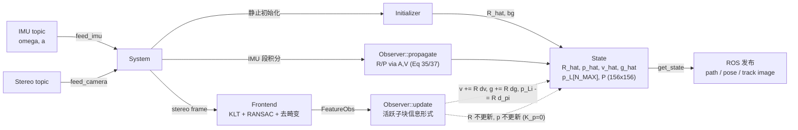

# HNO-SLAM：基于 $SE_{3+n}(3)$ 几何观测器的双目视觉惯性里程计

本包实现了 Boughellaba 等人 2026 年提出的
**"Nonlinear Observer Design for Visual-Inertial Odometry"** 论文中的非线性几何观测器，
用于双目视觉惯性里程计（Stereo VIO）。

**本系统不是 EKF-SLAM、不是 MSCKF、不是滑窗优化**，而是一个在矩阵李群
$SE_{3+n}(3)$ 上设计的**级联非线性观测器**，具有几乎全局渐近稳定性保证。

---

## 一、理论框架（论文核心约束）

### 1.1 状态定义（论文 Eq. 4 / 17）

系统状态在矩阵李群 $SE_{3+n}(3)$ 上联合表示机体姿态、平移、速度、重力与 $n$ 个路标点：

$$
\hat{X} = M(\hat{R}, \hat{p}, \hat{v}, \hat{g}, \hat{p}_L), \quad
\hat{p}_L = [\hat{p}_1, \hat{p}_2, \ldots, \hat{p}_n]
$$

### 1.2 旋转-平移解耦原则（论文 Eq. 46）

**姿态 $\hat{R}$ 绝不接受视觉残差的跳变修正**。它仅通过 IMU 角速度积分，
并受重力方向误差 $\sigma^R = k_R \hat{g} \times g$ 的连续时间反馈修正：

$$
\dot{\hat{R}} = \hat{R}\,[\omega_B + \hat{R}^T \sigma^R]_\times
$$

### 1.3 平移 LTV 误差系统（论文 Eq. 31 / 35 / 37）

平移子系统的误差状态（**不含 $R$ 与 $p$**）为：

$$
x = \begin{bmatrix} R^T \tilde v \\ R^T \tilde g \\ (R^T(\mathbf{1}\otimes \tilde p - \tilde p_L))^{\vee} \end{bmatrix}
\in \mathbb{R}^{6 + 3n}
$$

其线性时变误差动力学 $\dot x = (A(t) - L(t)C(t))\,x$，其中

$$
A(t) = \begin{bmatrix} D(t) & 0_{6\times 3n} \\ B_n \otimes I_3 & I_n \otimes (-[\omega_B]_\times) \end{bmatrix},\quad
D(t) = \begin{bmatrix} -[\omega_B]_\times & I_3 \\ 0 & -[\omega_B]_\times \end{bmatrix},\quad
B_n = [\mathbf{1}_n,\,0_{n\times 1}]
$$

关键特征：每个活跃路标的误差受速度误差 $R^T \tilde v$ 驱动（$B_n \otimes I_3$ 的
$I_3$ 耦合项），这是正确传播 $v\leftrightarrow p_i$ 交叉协方差的前提。

### 1.4 视觉测量模型（双目 bearing，论文 Eq. 20 / 21 / 27）

对左右目 $q \in \{l, r\}$ 分别取归一化射线 $\bar y_i^q$ 并构造机体系投影算子：

$$
\Pi_i = \sum_{q \in \{l, r\}} R_{B}^{C_q}\,\pi(\bar y_i^q)\,R_{B}^{C_q T},\quad
\pi(x) = I - \frac{x x^T}{\|x\|^2}
$$

单条观测的 3 维残差（与 $C(t)$ 仅在对应路标列块为 $\Pi_i$、其余为 0 相对应）：

$$
\sigma^p_i = \Pi_i\,\big(\hat R^T(\hat p_i - \hat p) - p_{bc}\big)
$$

### 1.5 离散跳变（论文 Algorithm 1，$K_p = 0$ 特化）

$$
\boxed{\;\hat R^+ = \hat R,\qquad \hat p^+ = \hat p\;}
$$

$$
\hat v^+ = \hat v + \hat R\,\delta_v,\qquad
\hat g^+ = \hat g + \hat R\,\delta_g,\qquad
\boxed{\;\hat p_i^+ = \hat p_i - \hat R\,\delta_{p_i}\;}
$$

**速度/重力用 `+`、路标用 `-`**，符号差来自 Eq. 31 中 $x$ 的定义差异，
以及 Eq. 45 中 $\Gamma$ 的显式负号。

---

## 二、软件架构（5 模块解耦）

```
src/hno_slam/
├── include/hno_slam/
│   ├── State.h         # 数据容器 + 固定槽位池
│   ├── Observer.h      # 数学核心：propagate / update
│   ├── Frontend.h      # KLT + 双目匹配 + RANSAC
│   ├── Initializer.h   # 静止初始化
│   └── System.h        # 顶层调度
├── src/
│   ├── State.cpp
│   ├── Observer.cpp
│   ├── Frontend.cpp
│   ├── Initializer.cpp
│   ├── System.cpp
│   └── main_node.cpp   # ROS 桥接
├── thirdparty/         # 裁剪自 ov_core 的 KLT / CamBase 等
└── euroc_mav/config/
    ├── estimator_config.yaml
    ├── kalibr_imu_chain.yaml
    └── kalibr_imucam_chain.yaml
```

### 2.1 `State` — 纯数据容器 + 固定槽位池

| 字段 | 含义 |
|---|---|
| `R_hat` | 姿态（SO(3)，非线性） |
| `p_hat`, `v_hat`, `g_hat` | 位置、速度、机体系重力（$\mathbb{R}^3$） |
| `p_L[N_MAX]` | 路标世界坐标池，`N_MAX = 50` |
| `is_active[N_MAX]` | 槽位生死位图 |
| `feature_ids[N_MAX]` | 槽位 → 前端 feature id 映射 |
| `track_counts[N_MAX]` | 累计跟踪次数（用于成熟度判定） |
| `P` | **固定大小** $(6 + 3 N_{\max}) \times (6 + 3 N_{\max}) = 156 \times 156$ |

**固定槽位池设计**：`P` 从不 resize，避免运行时大矩阵重分配。新点找空槽位
写入并把该 3×3 对角块设为先验方差、十字行列置零；跟丢点只把 `is_active = false`，
不移动矩阵数据。

### 2.2 `Observer` — 数学核心

#### `propagate(state, ω_m, a_m, dt)` — 连续动力学积分

1. 计算姿态反馈 $\sigma^R = k_R\,\hat g \times g_{ref}$
2. 等效角速度 $\omega_{eff} = \omega_m + \hat R^T \sigma^R$，罗德里格斯积分更新 $\hat R$
3. SVD 正交投影强制 $\hat R \in SO(3)$
4. $\hat p, \hat v, \hat g, \hat p_i$ 的一阶欧拉积分（对应 Eq. 47–50）
5. 构建 $A(t)$ 矩阵（含 $B_n\otimes I_3$ 的 $p_i \leftarrow v$ 耦合）
6. 构建 $V(t)$ 矩阵：IMU 噪声注入到 $(v,g)$ 子块、`landmark_noise_density²` 注入到**每个活跃路标对角块**（保证 $V(t) \succ 0$，满足 Theorem 1）
7. 离散 Riccati 传播 $P \leftarrow P + (AP + PA^T + V)\,dt$
8. 末端对称化 $P \leftarrow \tfrac{1}{2}(P + P^T)$

#### `update(state, observations)` — 离散跳变更新（信息形式，活跃子块）

1. 建立有效观测集（已跟踪点直接复用；新点先双目三角化并入池）
2. 索引化：`used_slots` 收集本帧出现的槽位，建立 slot → local 映射
3. 从 `state.P` 抽取 $(6 + 3 n_{active})$ 活跃子块 `P_sub`
4. 构建残差 $r$、观测雅可比 `C_sub`（仅在 local 路标列放 $\Pi_{total}$，$v, g$ 列为 0）、测量噪声 $Q$
5. **信息形式解算**：$M = P_{sub}^{-1} + C_{sub}^T Q^{-1} C_{sub}$，$\delta = M^{-1} C_{sub}^T Q^{-1} r$
6. 应用跳变（$K_p = 0$）：$\hat v \mathrel{+}= \hat R \delta_v$，$\hat g \mathrel{+}= \hat R \delta_g$，$\hat p_i \mathrel{\mathbf{-}}= \hat R \delta_{p_i}$
7. 后验 $P_{sub}^+ = M^{-1}$ 对称化后**散射回** `state.P` 对应行/列；非活跃槽位保持不变

> 相比于对 $156 \times 156$ 大矩阵直接求逆，活跃子块解算同时避免了
> 因非活跃对角（$\approx 10^{-8} I$）与活跃对角（$\mathcal{O}(1)$）量级差异导致的病态。

### 2.3 `Frontend` — 视觉前端

- **KLT 跟踪**：基于 `ov_core::TrackKLT`（包内裁剪），最大 200 点，直方图均衡
- **双目匹配**：按 feature id 在左右目观测中互查
- **RANSAC 剔除**：基于上一帧→当前帧左目位移估计基础矩阵，剔除动态/误匹配
- **去畸变**：左右目像素各自用 `CamBase::undistort_d` 投影到归一化平面
- **输出**：`std::vector<FeatureObs>`（id + 左右目归一化坐标），**不维护地图、不做滤波**

### 2.4 `Initializer` — 静止初始化

- 收集 1 秒 IMU 数据（200 帧窗口，加速度方差 & 陀螺方差都低于阈值）
- 加速度均值对齐 $-g_{ref}$ → 初始 $\hat R$
- 陀螺均值 → 陀螺零偏 $b_g$
- 零速假设 → $\hat v = 0$
- 机体系重力 $\hat g = (0, 0, -9.81)$

### 2.5 `System` — 顶层调度

- 互斥锁保护的 IMU 环形缓冲
- 相机帧到达后，按时间插值、逐段调用 `Observer::propagate`
- 调用 `Frontend::process_frame` → 得到本帧观测 → 清理丢失槽位 → `Observer::update`
- 生成跟踪可视化（左目红圈=成熟活跃，黄圈=仅跟踪未成熟）

---

## 三、数据流



---

## 四、关键配置（`euroc_mav/config/estimator_config.yaml`）

| 参数 | 默认值 | 含义 |
|---|---|---|
| `k_R` | 1.0 | 姿态重力反馈增益 |
| `up_slam_sigma_px` | 1.0 | 归一化平面测量噪声 $\sigma$ |
| `landmark_noise_density` | `1.0e-4` | 路标过程噪声密度 $\sigma_p^{proc}$（m/$\sqrt{s}$），保证 $V(t)\succ 0$ |
| `relative_config_imu` | `kalibr_imu_chain.yaml` | IMU 标定文件（读 `accelerometer_noise_density`、`gyroscope_noise_density`） |
| `relative_config_imucam` | `kalibr_imucam_chain.yaml` | 双目外参与内参 |

---

## 五、严格约束一览（不可违背）

| 约束 | 原因 |
|---|---|
| $\hat R$ 不接受视觉跳变 | Eq. 46 / 旋转-平移解耦 |
| $\hat p$ 不接受视觉跳变 | $K_p = 0$ / 全局位置不可观 |
| `P` 维度恒为 $(6 + 3 N_{\max})^2$ | 固定槽位池，避免运行时 resize |
| 误差状态 $x$ 仅含 $v, g, p_L$ | Eq. 31 / LTV 子系统 |
| 3D 射线残差（$\Pi_i$ 投影） | Eq. 21，非 2D 像素残差 |
| 路标跳变使用 **负号** `-= R δ` | Eq. 45 中 $\Gamma$ 的显式负号 |

---

## 六、构建与运行

```bash
cd ~/hno-slam-ws
catkin build hno_slam   # 或 colcon build --packages-select hno_slam

source devel/setup.bash  # 或 install/setup.bash
roslaunch hno_slam hno_slam.launch
```

在另一终端回放 EuRoC 数据集：

```bash
rosbag play V1_01_easy.bag
```

RViz 配置位于 [`launch/hno.rviz`](launch/hno.rviz)。
